# Review Report — fixes/auth

**Fecha:** 2026-05-11
**Comparación:** `fixes/auth` → `main`
**Generado por:** Darwoft

## Resumen de commits

- `c77d24d` — feat(auth): thread niche context through signup → verify flow
- `2b679cd` — feat(auth): redesign login/signup with magic link + Google + verify route

## Archivos modificados

### Pantallas

- `app/login/page.tsx` — refactor del layout (back arrow, logo grande, "Welcome back." con dot primary)
- `app/signup/page.tsx` — refactor del layout + nuevo flow magic-link + features list en panel derecho
- `app/find-niche/page.tsx` — **NUEVA** — selector de nicho post-signup
- `app/verify/page.tsx` — **NUEVA** — confirma el magic link y setea cookie
- `app/n/[slug]/page.tsx` — CTA "Build your profile" ahora pasa `?niche=<slug>` a `/signup`

### Componentes

- `components/auth/login-form.tsx` — **NUEVO** — client component con validación + loading + password toggle + forgot link
- `components/auth/signup-form.tsx` — **NUEVO** — email-only + "Check your email" confirmation
- `components/auth/google-auth-button.tsx` — **NUEVO** — botón compartido para Google OAuth (mockeado)
- `components/auth/verify-handler.tsx` — **NUEVO** — dispara la action en `useEffect`, maneja error states
- `components/welcome/niche-selector.tsx` — **NUEVO** — UI del selector de nicho (cherry-picked de `fixes/welcome`)
- `components/app-shell/client-layout.tsx` — agrega `/verify` y `/find-niche` a la lista de páginas sin app-shell

### Server actions

- `app/actions/auth.ts` — refactor completo:
  - Validación tipo `AuthState` con `error` global y `fieldErrors` por campo
  - `signupAction` ahora retorna `{ sent: { email, niche? } }` en vez de redirect (magic link)
  - `verifyEmailAction(token, niche?)` setea cookie + redirige a `/n/<slug>` o `/find-niche`
  - `loginWithGoogleAction` / `signupWithGoogleAction` mockean OAuth (en real harían el handshake)
  - Helpers de sanitization: `safeRedirectTo` (no `//`, max 200 chars), `safeNiche` (regex `^[a-z0-9-]{1,64}$`)

### Estilos / tokens

- `app/globals.css` — override del autofill amarillo/blanco de Chromium **a nivel global** (afecta todos los inputs del proyecto, no solo auth)

---

## Cambios visuales

### `/login` — Login

**Desktop**

| Antes (main) | Después (esta rama) |
|---|---|
| 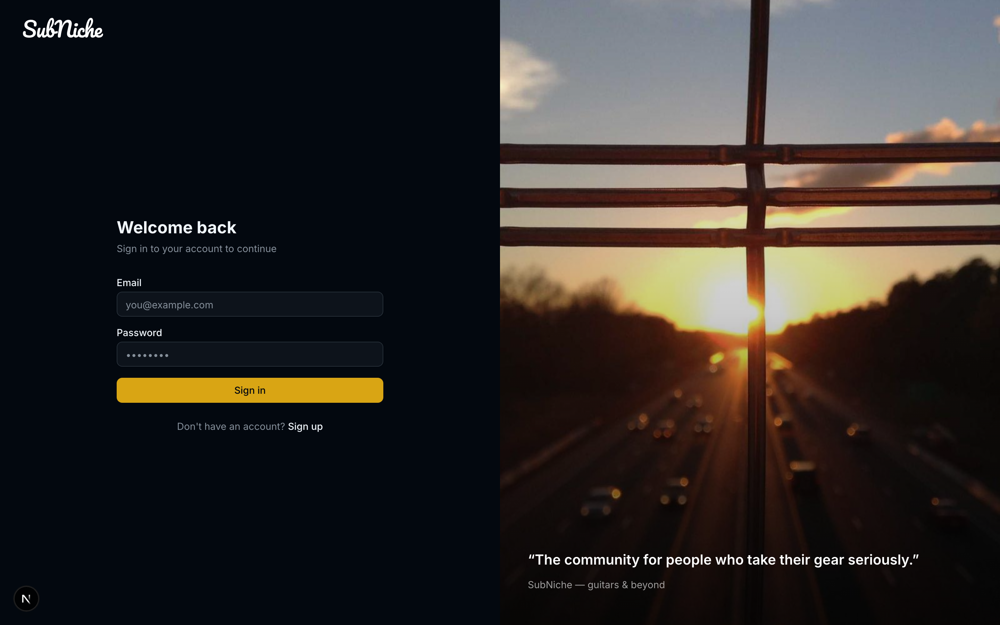 | 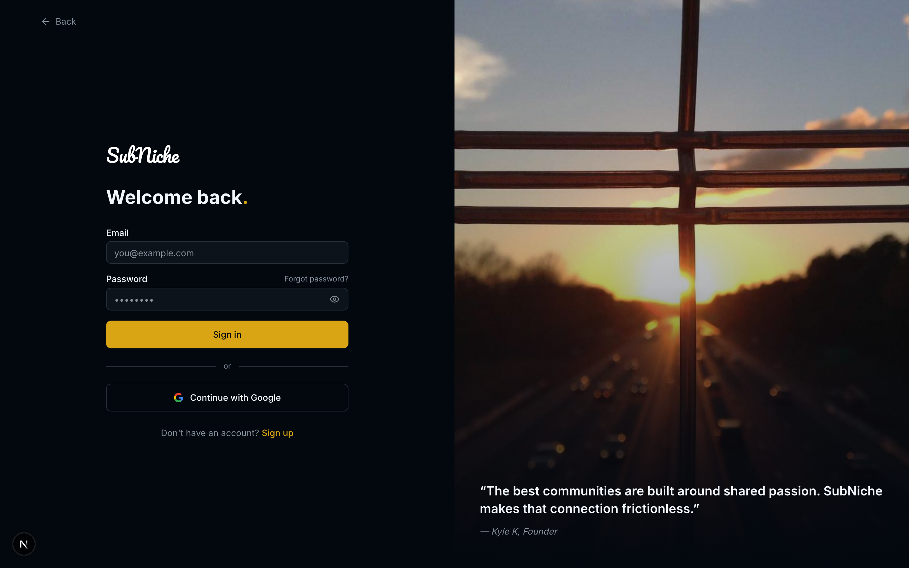 |

**Mobile**

| Antes (main) | Después (esta rama) |
|---|---|
| 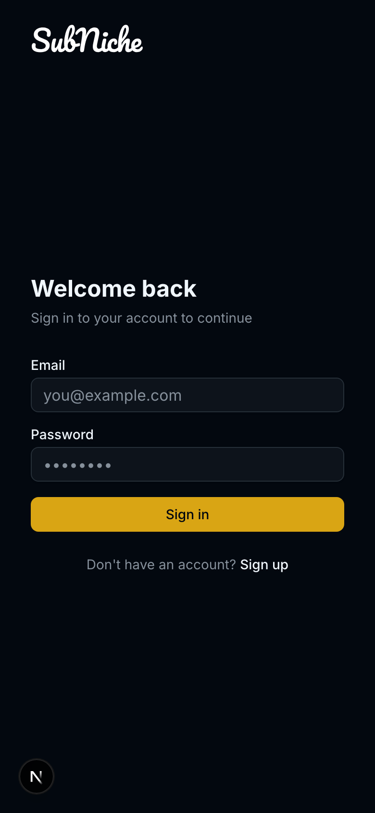 | 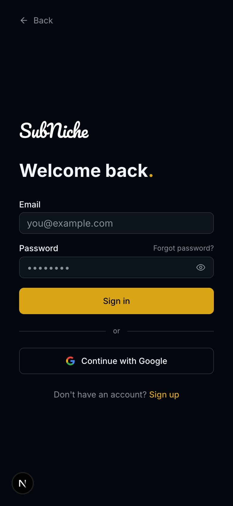 |

---

### `/signup` — Signup (magic link)

**Desktop**

| Antes (main) | Después (esta rama) |
|---|---|
| 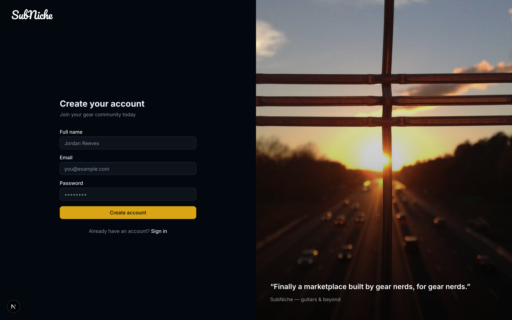 | 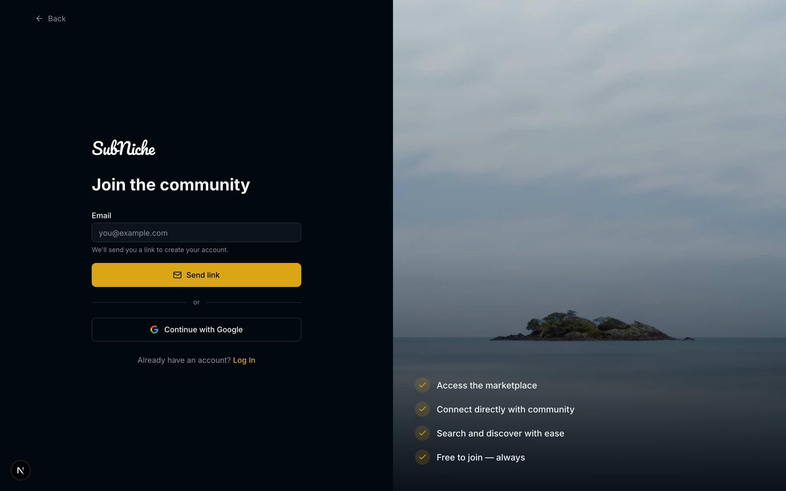 |

**Mobile**

| Antes (main) | Después (esta rama) |
|---|---|
| 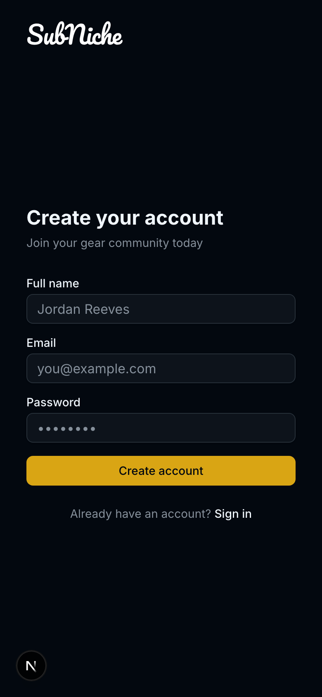 | 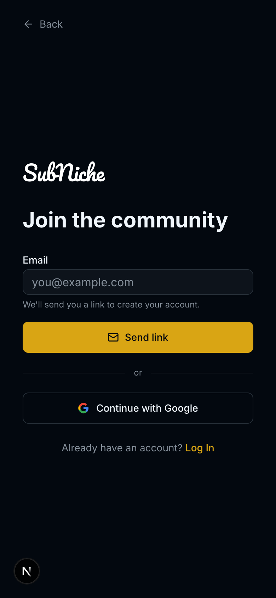 |

---

### `/signup?niche=music-gear` — Signup desde una niche home

> Nuevo estado: cuando el usuario entra al signup desde la home de un nicho, ese nicho se persiste en el flow y se auto-asigna al verificar el email. La página muestra una línea de contexto bajo el título.

**Desktop**

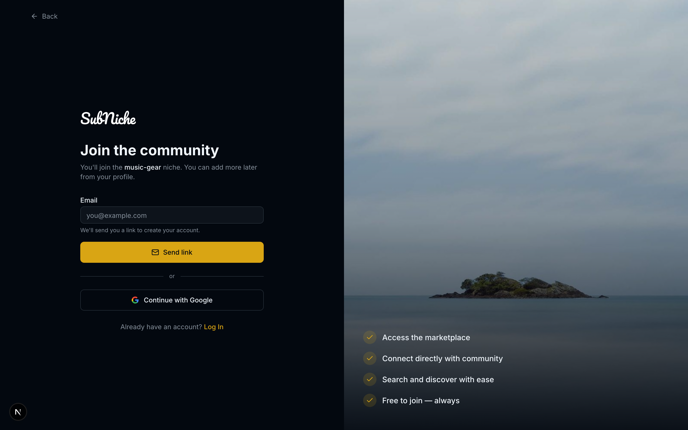

**Mobile**

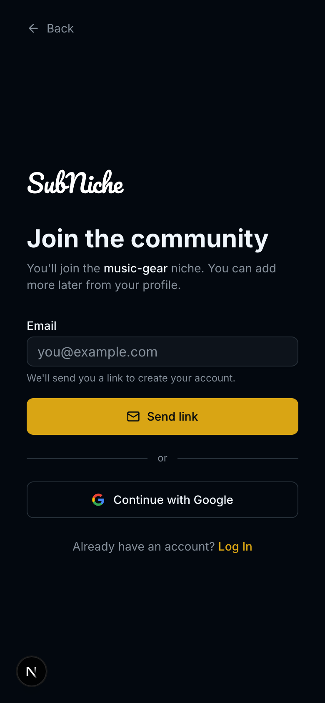

---

### `/n/music-gear` — Niche home

> Único cambio visible: el CTA del interstitial "Build your profile" ahora linkea a `/signup?niche=music-gear` (no se ve en captura, hay que comparar el `href` del link).

**Desktop**

| Antes (main) | Después (esta rama) |
|---|---|
| 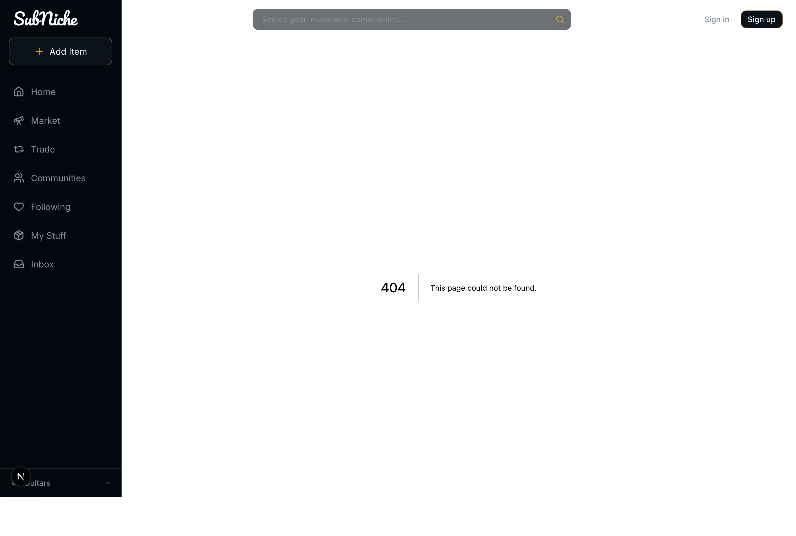 | 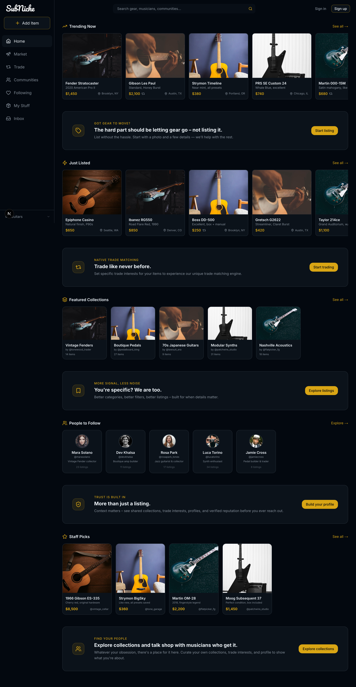 |

**Mobile**

| Antes (main) | Después (esta rama) |
|---|---|
| 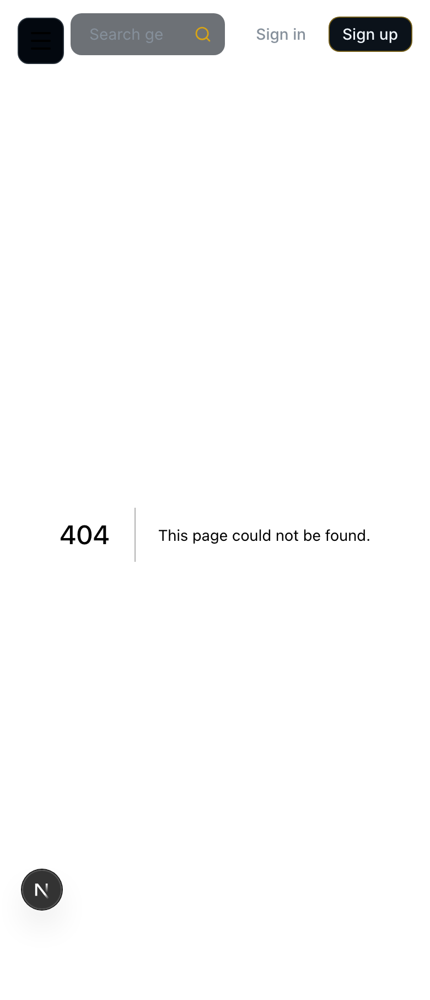 | 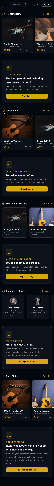 |

---

### `/find-niche` — Selector de nicho (NUEVA)

> Pantalla nueva. Se muestra después de verificar el email cuando el usuario hizo signup desde `/welcome` (sin contexto de nicho). Lista los nichos disponibles + "coming soon" + form para sugerir.

**Desktop**

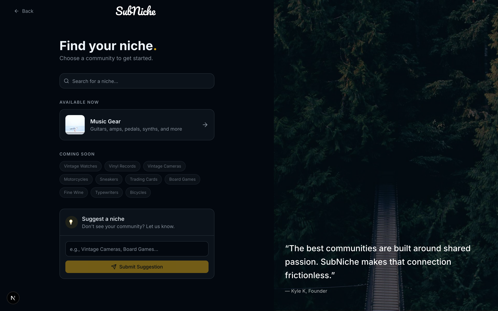

**Mobile**

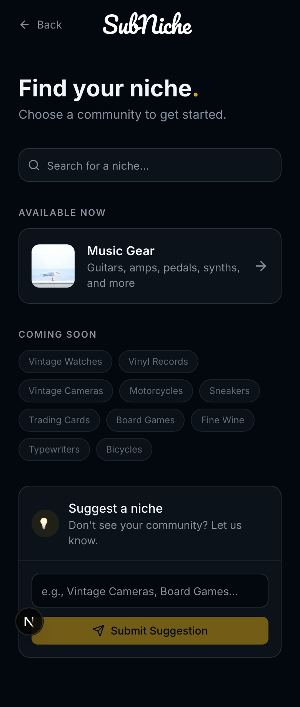

---

### `/verify` — Verificación de magic link (NUEVA)

> Captura del estado "missing token" (cuando se entra a `/verify` sin query param). El estado normal (`/verify?token=xxx`) muestra un spinner brevísimo y redirige; el de error solo se ve si el token es inválido o ausente.

**Desktop**

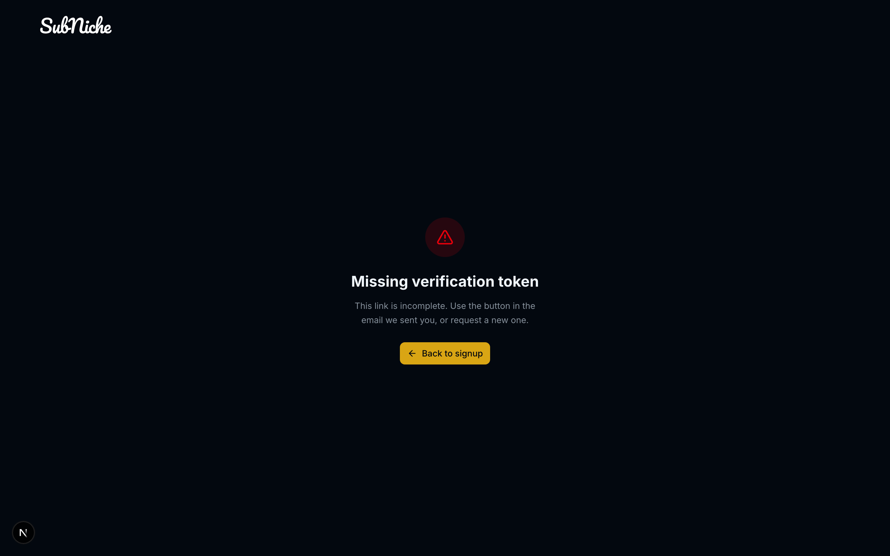

**Mobile**

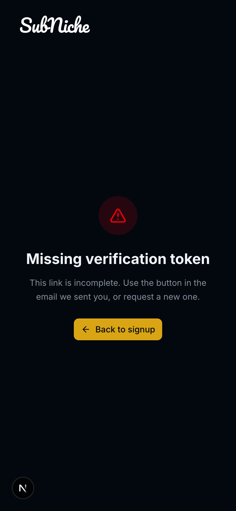

---

## Notas del diseñador

### Contexto del rediseño

Esta rama unifica varios fixes que hicimos al flow de auth. El driver principal: el signup quedó simplificado a **passwordless / magic link** (solo email → link al mail → verify → onboarding). El login mantiene email + password porque hay usuarios viejos con esa modalidad — pero le agregamos forgot-password, toggle de visibilidad y Google OAuth.

### Decisiones clave

**1. Magic link en signup**
- El usuario solo ingresa email. Se le envía un link de verificación.
- Al hacer click, `/verify?token=...` valida y setea la cookie `subniche_auth=onboarding`.
- **Importante para el backend:** ahora mismo `verifyEmailAction` acepta cualquier token no vacío (mock). Cuando integren, el token tiene que:
  - Persistirse en DB con expiración (mock dice "1 hora")
  - Asociarse al email del signup
  - Marcarse como consumido tras verificar

**2. Niche threading**
- Si el usuario hace signup desde `/welcome` → no tiene nicho → pasa por `/find-niche` antes del onboarding.
- Si hace signup desde `/n/music-gear` (o cualquier niche home) → ese nicho se persiste en el flow → al verificar entra directo a `/n/music-gear` con onboarding.
- El nicho viaja como query param: `/signup?niche=<slug>` → form hidden input → action retorna `sent.niche` → demo link incluye el niche → `/verify?token=xxx&niche=<slug>`.
- Validación de slug: regex `^[a-z0-9-]{1,64}$` tanto en el action como en la page (evita XSS y open redirect via path injection).

**3. Google OAuth — mockeado**
- Botón "Continue with Google" funciona pero el flow real **no está implementado**.
- `loginWithGoogleAction` y `signupWithGoogleAction` solo setean la cookie como si el OAuth hubiera sido exitoso.
- Para integrar: típicamente con NextAuth.js o similar. Mantener la firma de las server actions para no romper la UI.

**4. Design system**
- Login y signup usan ahora `<Input>`, `<Button>` y `<Label>` de shadcn (`components/ui/`).
- Removimos los `className="bg-card"` que sobrescribían el background del Input — el component del DS ya maneja `aria-invalid` con borde destructive automático.
- Gradientes hardcodeados (`from-black/70 via-black/20`) reemplazados por tokens (`from-background via-background/40`).

**5. Accessibility**
- Cada input con error tiene `aria-invalid` y `aria-describedby` apuntando al mensaje de error.
- Mensajes de error con `role="alert"` para anunciarse a screen readers.
- Buttons de submit muestran loading state explícito con icono spinner + texto "Signing in…" / "Sending link…".
- Password toggle tiene `aria-label` dinámico ("Show password" / "Hide password") y `tabIndex={-1}` para no romper el flujo de tab.

**6. Autofill global**
- Override del `:-webkit-autofill` en `app/globals.css` — usa el truco del `box-shadow inset` porque Chromium ignora `background-color` en inputs autofilleados.
- **Esto afecta TODOS los inputs del proyecto**, no solo los de auth. Si ven inputs viejos que tenían un autofill custom, este los uniforma al fondo del tema.

**7. Seguridad — hardening en server action**
- `redirectTo`: ahora se valida que empiece con `/`, no empiece con `//` (open redirect), y máx 200 chars.
- Email: regex simple `^[^\s@]+@[^\s@]+\.[^\s@]+$`. No es RFC-compliant pero cubre 99% de los casos.
- Cuando integren con backend real, agregar rate limiting al endpoint que envía emails (para evitar spam de magic links).

### Cosas a prestarle atención

- **Mobile signup**: el screen "Check your email" tiene un botón "Demo: open verification link" en estilo dashed que **NO va a producción**. Lo dejamos para que se pueda demostrar el flow sin email real. Removerlo antes del deploy o gatear por `process.env.NODE_ENV === "development"`.
- **El link real del email** debe apuntar al dominio público: `https://subniche.com/verify?token=<jwt>&niche=<slug?>`. La URL la genera el backend, no el front.
- **`/find-niche`** está exenta del app-shell (sin sidebar/header) — si quieren cambiar eso, está en `components/app-shell/client-layout.tsx`.
- **El cookie `subniche_auth`** ahora se setea con el valor `"onboarding"` desde verify y google-signup, y `"logged-in"` desde login. La lógica de qué muestra cada estado vive en `lib/auth.ts` (no la tocamos).

### TODO sugeridos para próximas iteraciones

- Implementar el endpoint backend que genera el token y manda el email (SendGrid / Postmark / etc.)
- Implementar OAuth real con Google (NextAuth o equivalente)
- Página `/forgot-password` (el link ya existe en login pero no apunta a nada)
- Considerar agregar verificación de email también en el flow de Google (algunos usuarios pueden tener Google sin email verificado)
